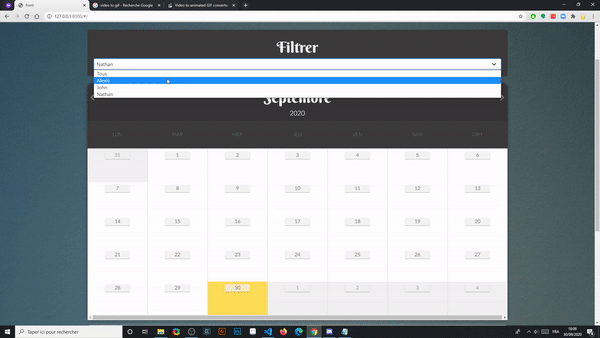

# Work Calendar

A calendar application to manage its employees.



## Stack

- Python3 and `Django Rest Framework`
- NodeJS and `Nuxt.js`, `SCSS`, `Typescript`, `Buefy`
- PostgreSQL
- Travis-ci
- Heroku

## Workflows

- **Git**: [Gitmojis](https://gitmoji.carloscuesta.me/) 🚀
- **SCSS**: [BEM](http://getbem.com/introduction/)
- **Javascript**: [AirBnB Style Guide](https://github.com/airbnb/javascript)
- **Python**: [PEP8](https://www.python.org/dev/peps/pep-0008/) - [PEP257](https://www.python.org/dev/peps/pep-0257/) - [Black](https://github.com/psf/black)

- **leading principle**: [Keep It Simple, Stupid (KISS)](https://en.wikipedia.org/wiki/KISS_principle)
- **Global**: [UsesCases](https://fr.wikipedia.org/wiki/Cas_d%27utilisation) - [Test Driven Developement](https://fr.wikipedia.org/wiki/Test_driven_development) (not fully) - [Clean Architecture](<https://en.wikipedia.org/wiki/Hexagonal_architecture_(software)>)

## Installation

This project uses **NodeJs** `v12` and **Python** `v3.7`.
You also need a **PostgreSQL** database.
Clone this repository, then run the following commands at the root of the repository:

```bash
# frontend installation
$ cd front && npm install && npm run generate && cd ..

# backend installation
$ pip install pipenv && pipenv install && pipenv run python manage.py migrate
```

The project uses some `env` variables. It is recommended to create an `.env` file at the root of the project. Pipenv will generate the virtual environment.

The environment variables are :

```bash
SECRET_KEY  # Django secret key
IS_DEBUG  # Define this variable if you want a DEBUG app

DB_USER  # database user name
DB_PASS  # database user password
DB_NAME  # database name
DB_HOST  # database host
DB_PORT  # database port
```

## Usage

Run `pipenv run python manage.py runserver` then go to `http://localhost:8000/`

## Local developement

Rather than generating the frontend at each modification, you can simply use the `cd front; npm run serve` command. The command will generate the front-end Nuxt server at `http://localhot:3000` with the Hot Reload.
Run `pipenv run python manage.py runserver` to launch the backend API.

## Authentication system

The authentication system is strong in the backend, but very simple in the frontend. To access the administration components, all you have to do is connect with a username that is worth `admin`. It is therefore advisable to create a backend superuser whose name is `admin`.

> **Note :** you can customize this feature in the `authenticate` method of the `auth` service (`front\src\clean_architecture\services\auth.ts`)

In fact, the permissions system in Frontend is based on a `right` variable stored in the `localStorage`. The admin components expect the value `admin` for the `right` variable (`localStorage.getItem("right")`).

> **Note :** having access to the admin components does not allow you to have write or read admin permissions. The backend will always act as a barrier if the frontend is hacked.

## Tests

The project uses :

- **[WebDriver.io](WebDriver.io)** for end2end tests.
- **[Jest](https://jestjs.io/)** for frontend unit testing.
- **[Pytest](https://docs.pytest.org/en/stable/)** for python unit testing.
- **[Postman](https://documenter.getpostman.com/view/4488938/TVCb5WRF)** for some Postman tests.

```bash
# End2end tests
$ cd front; npm run test:e2e  # need a running server.
# Javascript unit tests
$ cd front; npm run test:unit
# Python unit tests
$ pipenv run python pytest back/tests
# Postman : import the project from the documentation
# and open your Postman application and run the tests inside.
```

## Continuous Developement

The project uses Travis-ci. Add your fork to travis-ci.com and enjoy ! Read `.travis.yml` for more informations about the configuration.

> Note: Travis-ci only launches unit tests, the end2end tests being very heavy to set up in CI.

## Continuous Integration

Travis-ci is configured to automatically deploy the code on Heroku if the tests pass. For more information, see the documentation [on this topic](https://docs.travis-ci.com/user/deployment/heroku/).

## Postman documentation

The backend part of the application was designed with the Postman tool. The different use cases are exposed and some automations have been made.
Get the API documentation and tests [here](https://documenter.getpostman.com/view/4488938/TVCb5WRF) !

## deployment

At the time of deployment, it is necessary:

- create an administrator user
- create a simple user
- generate the days on Django with the command `pipenv run python manage.py create_initial_days`

> **Note :** use `pipenv run` if you are not yet in your virtual environment. Avoid it on Heroku.

Example for Heroku CLI ([read the doc here](https://devcenter.heroku.com/articles/scheduling-custom-django-management-commands)) :

```bash
# In your local CLI
heroku run bash -a <your-app-name>
```

```bash
# In your remote CLI
python manage.py migrate
python manage.py create_initial_days
python manage.py createsuperuser
python manage.py shell
```

```python
# In your Django shell
>>> from django.contrib.auth.models import User
>>> user = User.objects.create_user('user', 'your@email.com', 'yourpassword')
>>> quit()
```

```bash
# In your remote CLI
exit
```

It is also necessary to install a Cron job at the start of each month to update the data (delete the oldest month and create the new one): `pipenv run python manage.py update_days`

Exemple for [Heroku tasks scheduler](https://elements.heroku.com/addons/scheduler) (Thanks to [this article](https://blog.dbrgn.ch/2013/10/4/heroku-schedule-weekly-monthly-tasks/)):

```bash
if [ "$(date +%d)" = 01 ]; then python manage.py update_days; fi
```

## Credits

- Background photo by [Nicolas Solerieu](https://unsplash.com/@slrncl?utm_source=unsplash&utm_medium=referral&utm_content=creditCopyText) on [Unsplash](https://unsplash.com/photos/Hgb4gzB1ZPs)

## License

**MIT License** - For more informations, Read the `LICENSE` file.
